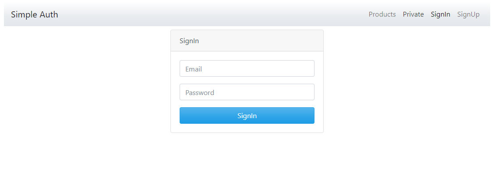

# JWT Simple Login MEAN

Proyecto muy simple con fines de guia y educaciòn.

# Requerimientos
 - MongoDB
 - Node
 - Npm
 - Angular 9

# Anotaciòn 
 - El proyecto de back utiliza mongoose como ORM por consiguiente no tenemos necesidad de crear la colecciòn ni el documento requerido.
 
# Instalaciòn
 - Iniciar MongoDB ya sea directamente por consola o por un contenedor.
 
 - Abrir la carpeta back
  - Ubicados en el proyecto back instalamos las dependencias con npm install 
  - Subir el servidor back con npm run dev
  - Si todo funciona bien nos indica que esta corriendo por el puerto 3000 y la base de datos esta conectada
 
 - Abrir la carpeta front
  - Ubicados en el proyecto front instalamos las dependencias con npm install
  - Subimos el servidor con ng serve
  - Abrimos el proyecto el navegador
 
 
 
 
 
